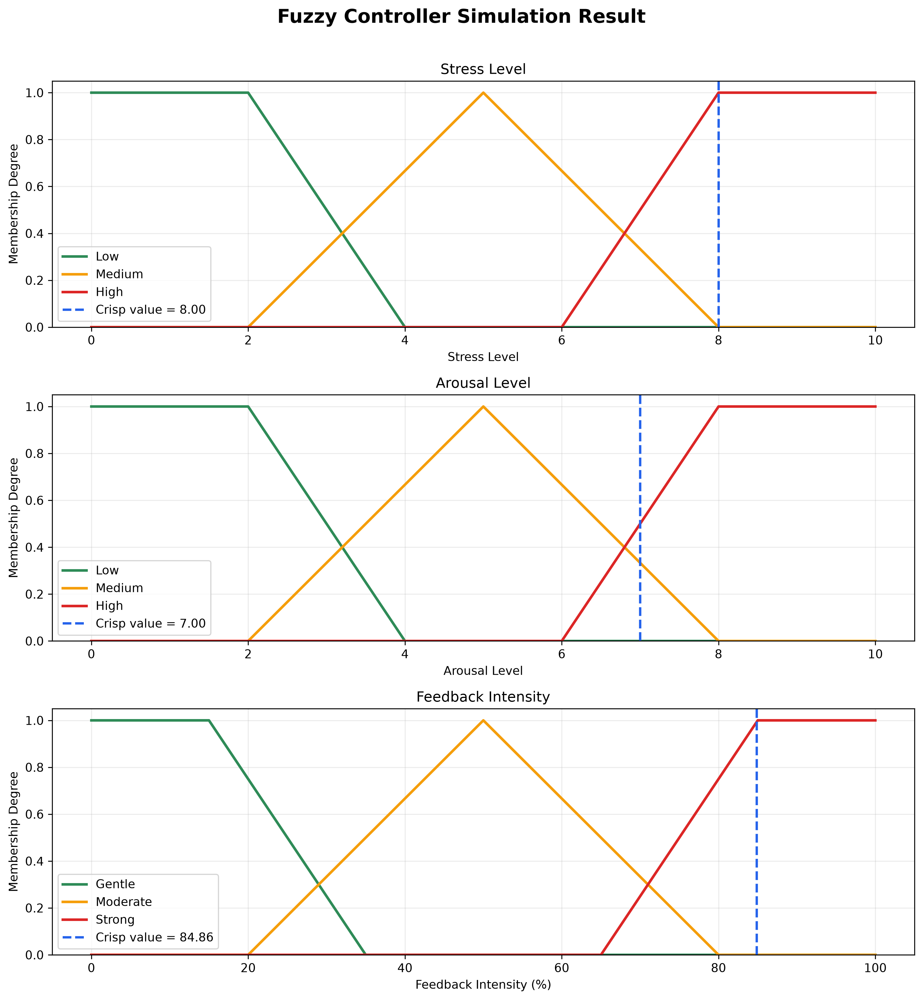
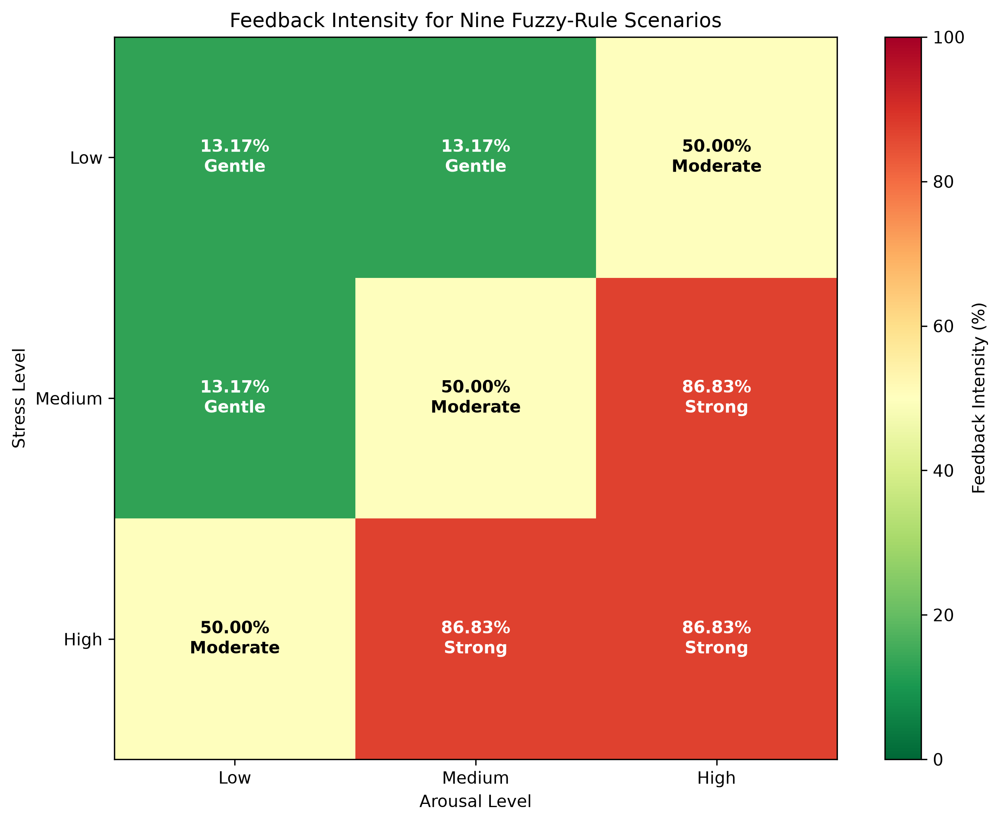
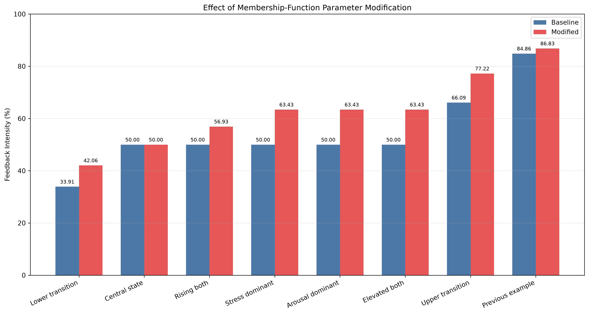

# Fuzzy Stress Regulation Controller

A Mamdani fuzzy-logic model that converts two crisp inputs—**stress level** and
**arousal level**—into a continuous **feedback intensity** from 0% to 100%.
The repository was created for Practical Task 1 in the *Intelligent Systems*
course and demonstrates model construction, inference, visualization,
scenario testing, and membership-function parameter modification in Python.

> **Educational use only:** this project is a fuzzy-control demonstration, not
> a medical device or diagnostic system.

## Project Highlights

- Two input variables on a 0–10 scale: stress and arousal
- One output variable on a 0–100% scale: feedback intensity
- Three linguistic terms for each variable
- A complete nine-rule Mamdani rule base
- Centroid defuzzification through `scikit-fuzzy`
- Interactive and command-line execution modes
- Nine-scenario experiment with a heatmap and CSV export
- Baseline-versus-modified parameter experiment
- Automated tests for reference values, symmetry, monotonicity, and validation

## Controller Design

| Variable | Type | Range | Linguistic terms |
|---|---|---:|---|
| Stress | Input | 0–10 | Low, Medium, High |
| Arousal | Input | 0–10 | Low, Medium, High |
| Feedback intensity | Output | 0–100% | Gentle, Moderate, Strong |

The baseline input membership functions are:

| Term | Function | Parameters |
|---|---|---|
| Low | Trapezoidal | `[0, 0, 2, 4]` |
| Medium | Triangular | `[2, 5, 8]` |
| High | Trapezoidal | `[6, 8, 10, 10]` |

The output membership functions are Gentle `[0, 0, 15, 35]`, Moderate
`[20, 50, 80]`, and Strong `[65, 85, 100, 100]`.

### Rule Base

| Stress \ Arousal | Low | Medium | High |
|---|---|---|---|
| **Low** | Gentle | Gentle | Moderate |
| **Medium** | Gentle | Moderate | Strong |
| **High** | Moderate | Strong | Strong |

## Example

For stress `8` and arousal `7`, the baseline controller produces:

```text
Feedback intensity: 84.86 %
Feedback category:  Strong
Suggested action:   Combined calming feedback and a rest reminder
```



## Repository Structure

```text
fuzzy-stress-controller/
├── .github/workflows/python-checks.yml
├── report/
│   ├── Fuzzy_Logic_Modeling_in_Python_Report_Mohammad_Azimi.docx
│   └── Fuzzy_Logic_Modeling_in_Python_Report_Mohammad_Azimi.pdf
├── results/
│   ├── membership_functions.png
│   ├── simulation_result.png
│   ├── scenario_comparison.csv
│   ├── scenario_comparison.png
│   ├── parameter_comparison.csv
│   ├── parameter_membership_comparison.png
│   └── parameter_output_comparison.png
├── tests/test_controller.py
├── main.py
├── scenario_experiments.py
├── parameter_comparison.py
└── requirements.txt
```

## Installation on Windows

Open Command Prompt in the directory where you want to store the project:

```bat
git clone https://github.com/mohammad-azimi/fuzzy-stress-controller.git
cd fuzzy-stress-controller
py -3.12 -m venv .venv
.venv\Scripts\activate
python -m pip install --upgrade pip
python -m pip install -r requirements.txt
```

If the repository is already cloned, activate its existing environment:

```bat
cd G:\Projects\Uni-Projects\fuzzy-stress-controller
.venv\Scripts\activate
```

## Running the Programs

### 1. Interactive controller

```bat
python main.py
```

Enter stress and arousal when prompted. The program prints the inference result,
saves the plots in `results/`, and opens the final visualization.

The same example can be executed non-interactively:

```bat
python main.py --stress 8 --arousal 7
```

Use `--no-show` to generate files without opening a plot window:

```bat
python main.py --stress 8 --arousal 7 --no-show
```

### 2. Nine-scenario experiment

```bat
python scenario_experiments.py
```

This evaluates all representative Low, Medium, and High combinations and
creates a CSV file and heatmap.



### 3. Parameter-modification experiment

```bat
python parameter_comparison.py
```

The modified input sets are shifted toward lower values:

| Term | Baseline | Modified |
|---|---|---|
| Low | `[0, 0, 2, 4]` | `[0, 0, 1.5, 3.5]` |
| Medium | `[2, 5, 8]` | `[1.5, 4.5, 7.5]` |
| High | `[6, 8, 10, 10]` | `[5, 7, 10, 10]` |

This makes the controller respond earlier in transition regions while leaving
the rule base and output sets unchanged. The largest measured increase in the
selected cases is **13.43 percentage points**.



## Automated Tests

Run the standard-library test suite with:

```bat
python -m unittest discover -s tests -v
```

The GitHub Actions workflow runs the same checks automatically after every
push and pull request.

## Report

- [Project report (PDF)](report/Fuzzy_Logic_Modeling_in_Python_Report_Mohammad_Azimi.pdf)
- [Project report (Word)](report/Fuzzy_Logic_Modeling_in_Python_Report_Mohammad_Azimi.docx)

## Academic Information

- **Student:** Mohammad Azimi
- **Group:** 5140901/61701
- **Course:** Intelligent Systems
- **Instructor:** Yuri Nurgalievich Kozhubaev
- **Institution:** Peter the Great St. Petersburg Polytechnic University
- **Year:** 2026

## References

1. D. A. Novak, Yu. N. Kozhubaev, and E. N. Ovchinnikova, *Modeling of Fuzzy
   Systems Controls in Python Programming*, 2024.
2. L. A. Zadeh, “Fuzzy Sets,” *Information and Control*, 1965.
3. E. H. Mamdani and S. Assilian, “An Experiment in Linguistic Synthesis with a
   Fuzzy Logic Controller,” *International Journal of Man-Machine Studies*, 1975.
4. [scikit-fuzzy documentation](https://scikit-fuzzy.readthedocs.io/)
